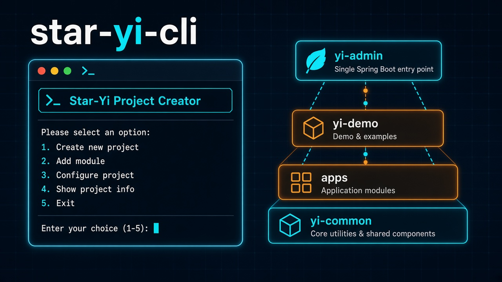

<p align="center">
  
</p>

<h1 align="center">star-yi-cli</h1>

<p align="center">
  <strong>Star-Yi 项目创建器</strong> · 从 GitHub 仓库拉取骨架、改名成新项目，并在项目根目录留下增删应用模块的命令
</p>

<p align="center">
  
  
  
  
</p>

---

## 它做什么

创建器本身不带模板。每个「版本」对应一个 GitHub 仓库，骨架怎么更新，创建出来的项目就跟着变：

| 版本 | 仓库 | 构建 | 新模块语言 |
|------|------|------|-----------|
| `star-yi` | [Star-yb/Star-Yi](https://github.com/Star-yb/Star-Yi) | Maven | Java |
| `star-yi-arc` | [Star-yb/Star-Yi-Arc](https://github.com/Star-yb/Star-Yi-Arc) | Gradle (Kotlin DSL) | Kotlin |

创建一个项目分四步：

1. **下载**：`git clone --depth 1` 指定分支；没有 git 或克隆失败时改用 GitHub zip 下载。仓库地址也可以是本机目录（本机 git 仓库只取已提交内容）。
2. **改名**：只改项目坐标，骨架模块名、包根 `com.star`、启动类都不动。
   - Maven：父 POM 的 `artifactId` / `groupId` / `version` / `<name>`，以及各子模块 `<parent>` 和内部依赖的坐标
   - Gradle：`rootProject.name`、根 `build.gradle.kts` 的 `group` / `version` / `description`
3. **落地**：删掉模板的 `.git`，建好应用目录（默认 `apps/`），写入 `.star-yi/project.yaml` 和根目录脚本 `star-yi.cmd` / `star-yi.sh`。
4. 可选 `git init`。

之后在项目里用 `star-yi.cmd add-app` / `remove-app` 增删业务模块，构建文件自动登记，`yi-admin` 自动依赖。

---

## 快速开始

```powershell
go build -o star-yi-cli.exe .
.\star-yi-cli.exe          # 打开本机页面
```

不带参数运行会在浏览器打开一个本机页面（只监听 `127.0.0.1`，带访问令牌）。关掉页面后创建器会自动退出，也可以点右上角「退出」。

页面有两个标签：

- **创建项目**：选版本，填父目录、项目名、展示名、groupId、版本；「高级」里可以临时换仓库、分支、应用目录。创建完成后显示日志、打开文件夹按钮和下一步命令。
- **版本设置**：改每个版本的仓库地址、分支、构建方式、新模块语言、默认应用目录和默认坐标；可以「检查仓库」，可以新增自定义版本，内置版本可恢复出厂设置。

同样的事都能用命令行完成：

```powershell
# 创建 Java / Maven 版
star-yi-cli new -e star-yi -p D:\work -n my-platform --display-name "我的平台" --group-id com.acme

# 创建 Kotlin / Gradle 版，业务模块放在 modules/biz
star-yi-cli new -e star-yi-arc -p D:\work -n my-arc --apps-dir modules/biz
```

---

## 在项目里增删应用

创建出来的项目根目录：

```text
my-platform/
├── .star-yi/project.yaml   # 版本、构建方式、应用目录……增删应用按这里来
├── star-yi.cmd             # Windows 入口
├── star-yi.sh              # macOS / Linux 入口
├── apps/                   # 业务模块
├── yi-admin/  yi-common/  yi-demo/ ...
```

```powershell
.\star-yi.cmd add-app -m order-service                      # 新增模块，包 com.star.orderservice
.\star-yi.cmd add-app -m crm --package crm --api-path /crm  # 自定义包和接口前缀
.\star-yi.cmd add-app -m report --depends order-service     # 依赖同项目里的其它应用
.\star-yi.cmd list                                          # 列出应用
.\star-yi.cmd remove-app -m report                          # 删除（会确认）
.\star-yi.cmd                                               # 不带参数：问答菜单
```

```bash
./star-yi.sh add-app -m order-service
```

**add-app** 做的事：

| | Maven（Star-Yi） | Gradle（Star-Yi-Arc） |
|---|---|---|
| 生成模块 | `pom.xml`（依赖 `yi-common`）+ Java 包目录 + `src/main/dto` | `build.gradle.kts`（依赖 `yi-common`）+ Kotlin 包目录 + `src/main/dto` |
| 登记 | 父 POM `<modules>` 和 `<dependencyManagement>` | `settings.gradle.kts` 的 `include` + `projectDir` |
| 接入启动模块 | `yi-admin/pom.xml` 加依赖 | `yi-admin/build.gradle.kts` 加 `project(":id")` |
| 编译检查 | `mvn -q compile -pl apps/<id> -am` | `gradle --no-daemon :<id>:compileKotlin` |

每个新模块带一个 `GET <api-path>/ping` 示例接口和 README。编译检查失败不会回滚，方便直接看报错修；没装 Maven / Gradle 时跳过检查，也可以用 `--skip-verify` 跳过。

**remove-app** 删目录并清掉上面所有登记。如果别的应用依赖它，会拒绝删除并列出依赖方，确认要删时加 `--force`。

脚本按这个顺序找创建器：

1. 环境变量 `STAR_YI_CLI`
2. `%APPDATA%\star-yi-cli\cli-path.txt`（每次运行 `star-yi-cli` 都会记录自己的位置）
3. `PATH` 里的 `star-yi-cli`

所以只要在这台机器上运行过一次创建器，项目里的脚本就能用，不需要把 exe 复制进项目。

---

## 配置

版本配置保存在 `%AppData%\star-yi-cli\config.yaml`（macOS 为 `~/Library/Application Support/star-yi-cli/`，Linux 为 `~/.config/star-yi-cli/`）。页面「版本设置」和下面的命令改的是同一个文件：

```powershell
star-yi-cli config show                                  # 查看
star-yi-cli config set --edition star-yi --branch dev    # 改分支
star-yi-cli config set --edition star-yi --repo D:\JAVA_File\springboot_web_file\Star-Yi
star-yi-cli config check star-yi-arc                     # 检查仓库和分支
star-yi-cli config reset star-yi                         # 恢复内置默认
star-yi-cli config path                                  # 配置文件位置
```

**配置只影响之后新建的项目。** 已有项目按自己的 `.star-yi/project.yaml` 增删应用；如果要换应用目录，改这个文件（或 `star-yi-cli init --apps-dir`）即可。

`new` 的 `--repo` / `--branch` / `--apps-dir` 只对这一次创建生效，不写回配置。

---

## 已有的老项目

用旧版创建器生成的项目没有 `.star-yi/`，可以补上：

```powershell
cd D:\work\old-project
star-yi-cli init --project .                 # 根据构建文件识别版本，写入 project.yaml 和脚本
star-yi-cli init --project . --apps-dir apps --force
```

之后旧的 `star-yi-project-tool.*` 和 `common-core/` 可以删掉。

---

## 命令一览

| 命令 | 说明 |
|------|------|
| `star-yi-cli` / `star-yi-cli ui` | 打开本机页面（`ui --port 8600 --no-browser` 可固定端口、不自动开浏览器） |
| `new` | 从版本仓库创建项目 |
| `app add` / `app remove` / `app list` | 增删查应用（项目脚本就是转调这里，`--project` 指定项目根，不传则从当前目录往上找） |
| `config path \| show \| set \| reset \| check` | 版本配置 |
| `init` | 给已有项目写入 `.star-yi/project.yaml` 和脚本 |

`new` 参数：

| 参数 | 默认 | 说明 |
|------|------|------|
| `-e, --edition` | `star-yi` | 版本 ID |
| `-p, --parent` | 当前目录 | 父目录，项目建在 `父目录/项目名` |
| `-n, --name` | 交互询问 | 项目名，同时是 `artifactId` / `rootProject.name` |
| `--display-name` | 同项目名 | Maven `<name>` / Gradle `description` |
| `--group-id` / `--version` | 取版本配置 | 项目坐标 |
| `--repo` / `--branch` / `--apps-dir` | 取版本配置 | 仅本次生效 |
| `--force` | false | 目标目录非空时覆盖同名文件 |
| `--git-init` | false | 创建后 `git init` |

---

## 开发

```powershell
go build -ldflags="-s -w" -o star-yi-cli.exe .
go vet ./...
go test ./...
```

```text
main.go
cmd/                 cobra 命令：root(ui) new app config init
internal/
  config/            版本配置读写
  source/            仓库下载：git clone / GitHub zip / 本机目录
  create/            创建流程：下载 → 改名 → 写元数据和脚本 → 落地
  build/             构建适配：maven.go（保留格式的 POM 编辑）、gradle.go（Kotlin DSL 行编辑）
  app/               应用模块增删查、模块源码生成
  meta/              .star-yi/project.yaml，老项目自动识别
  scripts/           star-yi.cmd / star-yi.sh
  xmledit/           保留缩进、换行、注释的 XML 编辑
  names/             项目名、模块名、包名等校验
  prompt/            终端问答
  ui/                本机页面服务，index.html 编译进 exe
```

新增一种构建方式时，在 `internal/build` 里实现 `Adapter` 接口并在 `For()` 注册即可，创建流程和页面不用动。

---

## 最后

如果 `star-yi-cli` 对你有帮助，欢迎 Star 或提 Issue。

有条件的小伙伴可以支持一下，请我喝杯奶茶，十分感谢。

<p align="center">
  
</p>

有问题、建议或想一起改模板，欢迎直接联系。

- **GitHub**：[Star-yb](https://github.com/Star-yb)
- **邮箱**：[starloongyibao@qq.com](mailto:starloongyibao@qq.com)
- **相关项目**：[StartDjango](https://github.com/Star-yb/StartDjango/tree/main)（Django 项目创建器）

## License

MIT
