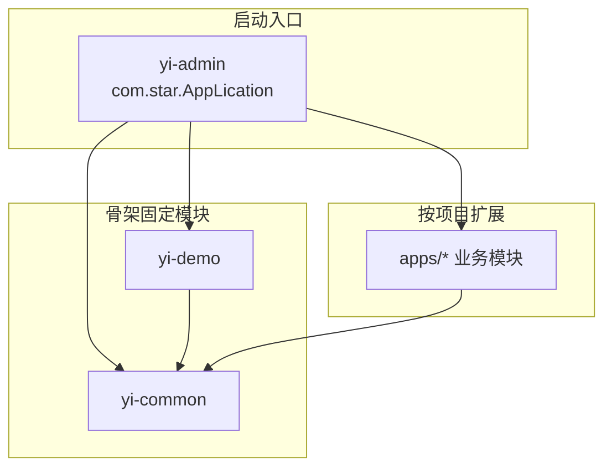

<p align="center">
  
</p>

<h1 align="center">star-yi-cli</h1>

<p align="center">
  <strong>Star-Yi 项目脚手架</strong> · 从骨架模板一键创建业务仓库，并在已有项目中增删 <code>apps/*</code> 模块
</p>

<p align="center">
  
  
  
  
  
</p>

---

## 项目信息

| 项 | 说明 |
|----|------|
| **项目名称** | `star-yi-cli` |
| **定位** | Star-Yi Maven 多模块骨架的命令行创建器 |
| **实现语言** | Go 1.22（Cobra CLI） |
| **模块路径** | `github.com/star/star-yi-cli` |
| **内置模板** | `templates/Star-Yi`（文件夹或 zip，优先 zip） |
| **生成物** | 可运行的 Spring Boot 后端工程 + 项目专用工具脚本 |

**Star-Yi** 是一套可复用的 Maven 多模块骨架。每个业务仓库都是在骨架上长出来的实例：固定模块不变，父工程坐标与 `apps/*` 业务模块按项目配置。

---

## 能做什么

| 能力 | 说明 |
|------|------|
| **创建新项目** | 从模板复制完整工程，替换占位符，生成父 POM、`yi-common`、`yi-admin`、`yi-demo` 和空 `apps/` |
| **添加业务模块** | 在已有项目中创建 `apps/<module>`，自动改父 POM、`dependencyManagement` 和 `yi-admin` 依赖 |
| **删除业务模块** | 删除模块目录，并清理三处 POM 引用 |
| **项目专用脚本** | 创建项目时自动生成 `star-yi-project-tool`，后续在该仓库内直接增删模块 |
| **交互 / 命令行双模式** | 无参数启动进入问答菜单；带参数可脚本化、可进 CI |
| **编译校验** | 添加模块后默认执行 `mvn compile -pl apps/<module> -am` |

> 规划中：`add crud`（按 `yi-demo` 金标准生成单表 CRUD 五层代码），当前版本尚未实现。

---

## 两种使用方式

```text
                  ┌─────────────────────┐
                  │    star-yi-cli      │
                  └──────────┬──────────┘
           无参数 / interactive        带子命令
                    │                    │
                    ▼                    ▼
            交互式问答菜单          new / add / remove / tool
            （推荐日常使用）         （适合脚本与 CI）
```

### 1. 交互式问答（推荐）

直接运行即可，无需记参数：

```powershell
go build -o star-yi-cli.exe .
.\star-yi-cli.exe
```

```text
╔══════════════════════════════════════╗
║     Star-Yi 项目创建器 (交互模式)     ║
╚══════════════════════════════════════╝

请选择要执行的操作：
  1) 创建新项目 (new)
  2) 添加 apps 业务模块 (add app)
  3) 删除 apps 业务模块 (remove app)
  4) 退出
```

- **创建新项目**：只问父目录 + 项目名；生成路径为 `父目录\项目名`。父目录留空 = 当前目录。目录已存在且非空时才会询问是否覆盖。
- **添加模块**：问项目根目录 + 模块名 + 包后缀（默认 `xxx`）。根目录留空时，会在当前目录及一级子目录中查找可用的 Star-Yi 项目。
- **删除模块**：同样自动定位项目根目录，删除目录并清理 POM。
- 操作结束后可返回主菜单继续其它任务。

将 `star-yi-cli.exe` 与 `templates/` 放在同一目录时，交互模式会自动识别默认模板。查找顺序：

```text
exe 同目录/templates/Star-Yi.zip  →  templates/Star-Yi  →  源码仓库 templates/...
```

zip 与文件夹同时存在时，**优先使用 zip**。

### 2. 命令行参数

#### 创建新项目

```powershell
star-yi-cli.exe new `
  --template .\templates\Star-Yi `
  --target D:\work\my-app `
  --artifact-id My-Platform `
  --name "我的平台" `
  --group-id com.star
```

| 参数 | 必填 | 默认 | 说明 |
|------|------|------|------|
| `--template` | 是 | — | 模板路径（文件夹或 `.zip`） |
| `--target` | 是 | — | 目标项目根目录 |
| `--artifact-id` | 是 | — | Maven `artifactId` / 项目坐标 |
| `--group-id` | 否 | `com.star` | Maven `groupId` |
| `--version` | 否 | `0.0.1-SNAPSHOT` | 项目版本 |
| `--name` | 否 | 同 artifact-id | 父 POM `<name>` 展示名 |
| `--apps-prefix` | 否 | 空 | 业务模块命名习惯（仅记录） |
| `--api-prefix` | 否 | 空 | 默认 REST 前缀 |
| `--sql-subdir` | 否 | 空 | SQL 相对 `sql/` 的子目录 |
| `--force` | 否 | false | 目标非空时强制覆盖 |

#### 添加 apps 业务模块

```powershell
cd D:\work\my-app
star-yi-cli.exe add app `
  --module-id order-service `
  --package-suffix order `
  --api-path /orders
```

自动完成：创建 `apps/order-service` 目录与 `pom.xml`、Java 包根、`src/main/dto`；注册父 `<modules>` 与 `<dependencyManagement>`；在 `yi-admin/pom.xml` 加入依赖；默认执行 Maven 编译验证。

#### 删除 apps 业务模块

```powershell
star-yi-cli.exe remove app --module-id order-service
```

1. 删除 `apps/order-service` 目录  
2. 从父 `pom.xml` 的 `<modules>` 移除  
3. 从父 `pom.xml` 的 `<dependencyManagement>` 移除  
4. 从 `yi-admin/pom.xml` 的 `<dependencies>` 移除  

#### 生成项目专用脚本

```powershell
star-yi-cli.exe tool init --project .
star-yi-cli.exe tool init --project . --all-platform
```

`new` 创建项目时会自动生成当前系统对应的脚本；`tool init` 用于手动重建或覆盖。

---

## 命令一览

| 命令 | 说明 |
|------|------|
| `star-yi-cli` / `interactive` / `-i` | 交互式问答菜单 |
| `new` | 从模板生成完整工程 |
| `add app` | 添加 `apps/*` 业务模块并改 POM |
| `remove app` | 删除 `apps/*` 并清理 POM |
| `tool init` | 生成当前项目专用跨平台脚本 |
| `--help` | 查看帮助 |

---

## 生成后的工程结构

```text
{projectArtifactId}/
├── pom.xml                      # 父工程（packaging=pom）
├── yi-common/                   # 公共能力：CRUD 基类、RBAC 实体、工具
├── yi-demo/                     # 标准 CRUD 示例（DemoArticle）
├── yi-admin/                    # 唯一启动模块  mainClass=com.star.AppLication
├── apps/                        # 业务域模块（创建器按需增删）
│   ├── order-service/
│   └── ...
├── sql/
├── star-yi-project-tool.cmd     # 项目入口脚本（根目录只留这一个）
└── common-core/
    └── star-yi-cli.exe          # CLI 本体（创建时自动复制）
```



**依赖约定**

| 模块 | 依赖谁 | 被谁依赖 |
|------|--------|----------|
| `yi-common` | 父 POM | `yi-demo`、`yi-admin`、全部 `apps/*` |
| `yi-demo` | `yi-common` | `yi-admin` |
| `apps/{任意}` | 至少 `yi-common`，可再依赖同仓库其它 apps | `yi-admin` |
| `yi-admin` | `yi-common` + `yi-demo` + 需上线的全部 apps | 无（唯一可执行入口） |

骨架模块名、包根 `com.star`、启动类 **不会**随业务项目改名。父工程 `artifactId` / `<name>` 以及 `apps/*` 命名由每次创建时的参数决定。

---

## 内置模板技术栈

| 项 | 版本 / 说明 |
|----|-------------|
| Java | 21 |
| Spring Boot | 4.0.3 |
| Jimmer | 0.10.6 |
| Sa-Token | 1.45.0 |
| MySQL | 8.2.0 |
| springdoc-openapi | 3.0.3（仅 `yi-admin` 引入 UI） |
| 管理端 | Thymeleaf SSR + RBAC（用户 / 角色 / 权限） |

平台自带能力（新项目开箱即有，不由业务 apps 生成）：

- 登录 / 登出 / Token：`/auth/**`
- 用户、角色、权限管理
- 管理后台页面：`/admin/**`
- OpenAPI / Swagger
- 全局异常、分页、通用 CRUD 五层封装

默认启动端口见 `yi-admin` 的 `application.yaml`（模板为 **8500**）。

---

## 项目专用脚本

创建完成后，根目录只保留入口脚本，CLI 放到 `common-core/`，避免污染工程根：

```text
项目根/
  pom.xml
  star-yi-project-tool.cmd    ← 入口
  common-core/
    star-yi-cli.exe           ← CLI 本体
```

脚本会把当前项目根固定为 `--project`，后续不必再传路径：

```powershell
star-yi-project-tool.cmd add-app --module-id ed-pp --package-suffix aaa
star-yi-project-tool.cmd remove-app --module-id ed-pp
```

```bash
./star-yi-project-tool.sh add-app --module-id ed-pp --package-suffix aaa
./star-yi-project-tool.sh remove-app --module-id ed-pp
```

无参数运行脚本时，进入问答菜单（1 = add-app，2 = remove-app）。

| 脚本 | 平台 |
|------|------|
| `star-yi-project-tool.cmd` | Windows CMD（默认） |
| `star-yi-project-tool.ps1` | Windows PowerShell |
| `star-yi-project-tool.sh` | macOS / Linux Bash |

`--all-platform` 可一次生成全部三种。脚本优先使用 `common-core/star-yi-cli.exe`；若要改用其它 CLI，可设置环境变量 `STAR_YI_CLI`。

```powershell
star-yi-cli.exe tool init --project . --cli star-yi-cli.exe --force
```

---

## 模板占位符

`new` 会遍历模板中的文本文件并替换下列占位符（不处理 Maven 的 `${...}`）：

| 占位符 | CLI 参数 |
|--------|----------|
| `{projectArtifactId}` | `--artifact-id` |
| `{projectName}` | `--name` |
| `{groupId}` | `--group-id` |
| `{version}` | `--version` |
| `{appsModulePrefix}` | `--apps-prefix` |
| `{defaultApiPrefix}` | `--api-prefix` |
| `{sqlSubDir}` | `--sql-subdir` |

**不替换**：Java 包名 `com.star.**`、`mainClass`、第三方依赖坐标。

---

## 构建本工具

```powershell
cd star-yi-cli
go mod tidy
go build -o star-yi-cli.exe .
```

体积优化：

```powershell
go build -ldflags="-s -w" -o star-yi-cli.exe .
```

测试：

```bash
go test ./...
```

---

## 生成后如何启动业务项目

```bash
cd <target>
mvn clean compile
mvn -pl yi-admin spring-boot:run
```

- 管理端：`http://localhost:8500`
- Swagger：`/swagger-ui.html`

删除模块后建议再编译一次，确认无残留引用：

```bash
mvn clean compile
```

```powershell
Select-String -Path .\* -Pattern "order-service" -Recurse
```

## 最后

如果 `star-yi-cli` 对你有帮助，欢迎 Star 或提 Issue。

有条件的小伙伴可以支持一下，请我喝杯奶茶，十分感谢。

<p align="center">
  
</p>

有问题、建议或想一起改模板，欢迎直接联系。

- **GitHub**：[Star-yb](https://github.com/Star-yb)
- **邮箱**：[starloongyibao@qq.com](mailto:starloongyibao@qq.com)
- **相关项目**：[StartDjango](https://github.com/Star-yb/StartDjango/tree/main)（Django 项目创建器）

## License

MIT